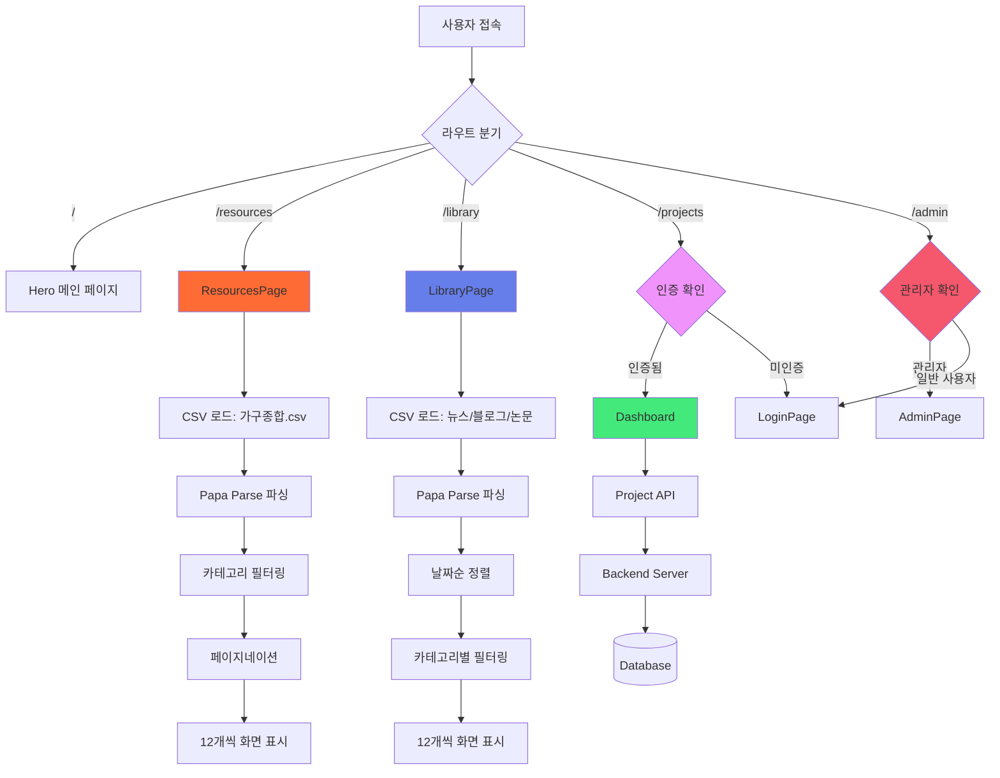

# 🏠 한샘 인테리어 플랫폼 (Hanssem Interior Platform)

> React 기반 인테리어 가구 탐색 및 프로젝트 관리 플랫폼

## 📋 목차
- [프로젝트 개요](#-프로젝트-개요)
- [기술 스택](#-기술-스택)
- [폴더 구조](#-폴더-구조)
- [주요 기능](#-주요-기능)
- [데이터 플로우](#-데이터-플로우)
- [컴포넌트 상세 설명](#-컴포넌트-상세-설명)
- [설치 및 실행](#-설치-및-실행)

---

## 🎯 프로젝트 개요

이 프로젝트는 **한샘 가구 데이터를 활용한 인테리어 플랫폼**으로, 사용자가 가구를 탐색하고, 인테리어 자료를 확인하며, 프로젝트를 관리할 수 있는 웹 애플리케이션입니다.

### 주요 특징
- 🛋️ **2,700개 이상의 가구 데이터** CSV 기반 관리
- 📚 **뉴스, 블로그, 논문** 통합 자료 라이브러리
- 🔐 **사용자 인증 시스템** (로그인/관리자 권한)
- 📊 **프로젝트 관리 대시보드**
- 🎨 **다크 모드 UI** with Framer Motion 애니메이션
- ⚡ **성능 최적화** (Lazy Loading, 페이지네이션)

---

## 🛠 기술 스택

### Frontend
| 기술 | 버전 | 용도 |
|------|------|------|
| React | 19.2.0 | UI 라이브러리 |
| React Router DOM | 7.9.4 | 라우팅 관리 |
| Framer Motion | 12.23.24 | 애니메이션 |
| Papa Parse | 5.5.3 | CSV 파싱 |
| Axios | 1.13.1 | HTTP 통신 |
| React Icons | 5.5.0 | 아이콘 |

### Styling
- **CSS-in-JS** (Inline Styles)
- **Tailwind CSS** 4.1.16
- **다크 모드** (#0a0a0a 배경)
- **Glassmorphism** UI

### Development
- **Create React App** 5.0.1
- **Testing Library** (Jest, React Testing Library)
- **Web Vitals** 성능 모니터링

---

## 📁 폴더 구조

```
ui/
├── public/                          # 정적 파일
│   ├── 20251020_가구종합.csv       # 가구 데이터 (2,711개)
│   ├── hanssem_contents.csv        # 뉴스/블로그 데이터
│   └── riss_FIN2.csv               # 논문 데이터
│
├── src/
│   ├── components/                 # 컴포넌트
│   │   ├── Navbar.js              # 네비게이션 바 (라우팅)
│   │   ├── Hero.js                # 메인 페이지 (홈)
│   │   ├── ResourcesPage.js       # 가구 탐색 페이지 ⭐
│   │   ├── LibraryPage.js         # 자료 라이브러리 페이지 ⭐
│   │   ├── Dashboard.js           # 프로젝트 관리 대시보드
│   │   ├── LoginPage.js           # 로그인 페이지
│   │   ├── AdminPage.js           # 관리자 페이지
│   │   ├── AboutPage.js           # 소개 페이지
│   │   ├── ResultsPage.js         # 프로젝트 결과 페이지
│   │   ├── ProtectedRoute.js      # 로그인 필수 라우트
│   │   ├── AdminRoute.js          # 관리자 전용 라우트
│   │   ├── ProjectCards.js        # 프로젝트 카드 UI
│   │   ├── ProjectTable.js        # 프로젝트 테이블 UI
│   │   ├── ProjectStats.js        # 프로젝트 통계
│   │   ├── NewProjectModal.js     # 새 프로젝트 생성 모달
│   │   └── AssembleLogo.jsx       # 로고 컴포넌트
│   │
│   ├── context/
│   │   └── AuthContext.js         # 인증 상태 관리 (Context API)
│   │
│   ├── api/
│   │   └── projectAPI.js          # 프로젝트 API 통신
│   │
│   ├── utils/
│   │   └── initializeAdmin.js     # 관리자 계정 초기화
│   │
│   ├── styles/
│   │   └── ResultsPage.css        # 결과 페이지 스타일
│   │
│   ├── App.js                     # 메인 앱 컴포넌트
│   ├── App.css                    # 전역 스타일
│   ├── index.js                   # React 진입점
│   └── index.css                  # 기본 CSS
│
├── package.json                   # 의존성 관리
└── README.md                      # 프로젝트 문서
```

---

## 🎨 주요 기능

### 1. 🛋️ Resources (가구 탐색 페이지)

**파일:** `src/components/ResourcesPage.js`

#### 기능 상세
- **CSV 데이터 로딩** - `20251020_가구종합.csv` (2,711개 가구)
- **2단계 카테고리 필터링**
  - 1차: `room_name` (거실, 침실, 주방 등)
  - 2차: `small_cat_name` (소파, 침대, 식탁 등)
- **"세트" 카테고리** - 2개 이상 단어 조합 가구 자동 분류
- **검색 기능** - 가구명 실시간 검색
- **페이지네이션** - 12개씩 표시, 최대 10개 페이지 번호
- **이미지 Lazy Loading** - 성능 최적화
- **로딩 인디케이터** - 데이터 로딩 중 스피너 표시

#### 주요 State
```javascript
const [furnitureData, setFurnitureData] = useState([]);     // 전체 가구 데이터
const [activeRoomCategory, setActiveRoomCategory] = useState("all");   // 선택된 공간
const [activeSmallCategory, setActiveSmallCategory] = useState("all"); // 선택된 가구 종류
const [currentPage, setCurrentPage] = useState(1);          // 현재 페이지
const [isLoading, setIsLoading] = useState(true);           // 로딩 상태
```

#### 핵심 함수
| 함수명 | 역할 |
|--------|------|
| `useEffect()` | CSV 파일 fetch 및 Papa Parse로 파싱 |
| `filteredFurniture` | 카테고리 + 검색어 기반 필터링 |
| `getPageNumbers()` | 페이지 번호 생성 (최대 10개) |
| `currentFurniture` | 현재 페이지 표시 데이터 슬라이싱 |

---

### 2. 📚 Library (자료 라이브러리 페이지)

**파일:** `src/components/LibraryPage.js`

#### 기능 상세
- **3개 카테고리 탭**
  - **News** - 한샘 관련 뉴스 (12개)
  - **Blog** - 블로그 포스트 (12개)
  - **Research Papers** - 논문 데이터
- **논문 키워드 필터링** - `keyword` 컬럼 기반
- **페이지네이션** (논문만) - 12개씩 표시
- **외부 링크 연결** - 새 탭에서 열기

#### CSV 데이터 구조
1. **hanssem_contents.csv**
   - `url`, `title`, `pubdate`, `source` (news/blog)
2. **riss_FIN2.csv**
   - `keyword`, `title`, `authors`, `journal`, `year`, `link`

#### 주요 State
```javascript
const [activeCategory, setActiveCategory] = useState("blog");  // news/blog/paper
const [activeKeyword, setActiveKeyword] = useState("all");     // 논문 키워드 필터
const [newsData, setNewsData] = useState([]);                  // 뉴스 12개
const [blogData, setBlogData] = useState([]);                  // 블로그 12개
const [paperData, setPaperData] = useState([]);                // 전체 논문
const [currentPaperPage, setCurrentPaperPage] = useState(1);   // 논문 페이지
```

#### 핵심 함수
| 함수명 | 역할 |
|--------|------|
| `parseDate()` | YYYY-MM-DD 형식 날짜 파싱 |
| `filteredPapers` | 키워드별 논문 필터링 |
| `getPaperPageNumbers()` | 페이지네이션 번호 생성 |
| `ContentCard` | 뉴스/블로그 카드 컴포넌트 |
| `PaperCard` | 논문 카드 컴포넌트 |

---

### 3. 🔐 인증 시스템

**파일:** `src/context/AuthContext.js`

#### Context API 구조
```javascript
const AuthContext = createContext();

export const AuthProvider = ({ children }) => {
  const [user, setUser] = useState(null);           // 로그인한 사용자
  const [isAuthenticated, setIsAuthenticated] = useState(false);  // 인증 상태

  const login = (username, password) => { /* ... */ };
  const logout = () => { /* ... */ };

  return (
    <AuthContext.Provider value={{ user, isAuthenticated, login, logout }}>
      {children}
    </AuthContext.Provider>
  );
};
```

#### 라우트 보호
- **ProtectedRoute** - 로그인 필수 (`/projects`, `/results/:id`)
- **AdminRoute** - 관리자 권한 필수 (`/admin`)

---

### 4. 📊 프로젝트 관리 (Dashboard)

**파일:** `src/components/Dashboard.js`

#### 기능
- 프로젝트 목록 조회 (카드/테이블 뷰)
- 새 프로젝트 생성
- 프로젝트 수정/삭제
- 통계 표시

**API 연동:** `src/api/projectAPI.js` (Axios)

---

## 🔄 데이터 플로우



---

## 🔧 컴포넌트 상세 설명

### App.js - 메인 라우터
**역할:** 전체 앱의 라우팅 관리

```javascript
<Router>
  <AuthProvider>           {/* 인증 상태 전역 관리 */}
    <Navbar />             {/* 모든 페이지에 표시 */}
    <Routes>
      <Route path="/" element={<Hero />} />
      <Route path="/resources" element={<ResourcesPage />} />
      <Route path="/library" element={<LibraryPage />} />
      <Route path="/projects" element={
        <ProtectedRoute><Dashboard /></ProtectedRoute>
      } />
      {/* ... */}
    </Routes>
  </AuthProvider>
</Router>
```

**학습 포인트:**
- React Router v7 사용법
- Context API 활용한 전역 상태 관리
- Protected Route 패턴

---

### ResourcesPage.js - 가구 탐색

**데이터 로딩 과정:**
```javascript
useEffect(() => {
  setIsLoading(true);
  fetch("/20251020_가구종합.csv")
    .then(response => response.text())
    .then(csvText => {
      Papa.parse(csvText, {
        header: true,           // 첫 행을 헤더로 사용
        skipEmptyLines: true,   // 빈 줄 건너뛰기
        complete: (results) => {
          const data = results.data.map((item, index) => ({
            id: `${item.goods_id}_${index}`,
            name: item.goods_name,
            price: item.price,
            imageUrl: item["Image URL"],
            roomName: item.room_name,
            smallCatName: item.small_cat_name,
          }));
          setFurnitureData(data);
          setIsLoading(false);

          // 카테고리 추출
          const uniqueRooms = [...new Set(data.map(item => item.roomName))];
          setRoomCategories(uniqueRooms);
        }
      });
    });
}, []);
```

**필터링 로직:**
```javascript
const filteredFurniture = furnitureData.filter((item) => {
  const roomMatch = activeRoomCategory === "all" || item.roomName === activeRoomCategory;

  // "세트" 카테고리 처리
  let smallCatMatch;
  if (activeSmallCategory === "set") {
    const words = item.smallCatName?.trim().split(/[\s,/]+/) || [];
    smallCatMatch = words.length > 1;
  } else if (activeSmallCategory === "all") {
    smallCatMatch = true;
  } else {
    smallCatMatch = item.smallCatName === activeSmallCategory;
  }

  const searchMatch = item.name?.toLowerCase().includes(searchText.toLowerCase());
  return roomMatch && smallCatMatch && searchMatch;
});
```

**학습 포인트:**
- CSV 파일 로딩 및 파싱 (Papa Parse)
- 다단계 필터링 로직 구현
- 페이지네이션 구현
- Lazy Loading으로 성능 최적화
- 정규식을 활용한 복합 조건 필터링

---

### LibraryPage.js - 자료 라이브러리

**멀티 CSV 로딩:**
```javascript
useEffect(() => {
  // 뉴스/블로그 CSV 로딩
  setIsLoadingContent(true);
  fetch("/hanssem_contents.csv")
    .then(/* ... */)
    .then(data => {
      const news = data
        .filter(item => item.source === 'news')
        .sort((a, b) => parseDate(b.pubdate) - parseDate(a.pubdate))
        .slice(0, 12);

      const blog = data
        .filter(item => item.source === 'blog')
        .sort((a, b) => parseDate(b.pubdate) - parseDate(a.pubdate))
        .slice(0, 12);

      setNewsData(news);
      setBlogData(blog);
      setIsLoadingContent(false);
    });

  // 논문 CSV 로딩
  setIsLoadingPaper(true);
  fetch("/riss_FIN2.csv")
    .then(/* ... */)
    .then(data => {
      setPaperData(data);
      const uniqueKeywords = [...new Set(data.map(item => item.keyword))];
      setPaperKeywords(uniqueKeywords);
      setIsLoadingPaper(false);
    });
}, []);
```

**학습 포인트:**
- 다중 데이터 소스 관리
- 날짜 기반 정렬 (최신순)
- 독립적인 로딩 상태 관리
- 탭 기반 UI 구현

---

### AuthContext.js - 인증 관리

```javascript
export const AuthProvider = ({ children }) => {
  const [user, setUser] = useState(() => {
    const savedUser = localStorage.getItem('user');
    return savedUser ? JSON.parse(savedUser) : null;
  });

  const login = (username, password) => {
    // 로그인 로직
    const userData = { username, role: 'user' };
    setUser(userData);
    localStorage.setItem('user', JSON.stringify(userData));
    setIsAuthenticated(true);
  };

  const logout = () => {
    setUser(null);
    localStorage.removeItem('user');
    setIsAuthenticated(false);
  };

  return (
    <AuthContext.Provider value={{ user, isAuthenticated, login, logout }}>
      {children}
    </AuthContext.Provider>
  );
};
```

**학습 포인트:**
- Context API 활용
- localStorage 활용한 세션 유지
- Custom Hook 패턴 (`useAuth`)

---

## 🎨 UI/UX 디자인 패턴

### 다크 모드 테마
```javascript
// 전역 배경색
background: "#0a0a0a"

// 카드 스타일 (Glassmorphism)
background: "rgba(255, 255, 255, 0.05)"
backdropFilter: "blur(10px)"
border: "1px solid rgba(255, 255, 255, 0.1)"
boxShadow: "0 10px 30px rgba(0, 0, 0, 0.3)"
```

### 애니메이션 (Framer Motion)
```javascript
// 페이드 업 효과
const fadeUp = {
  hidden: { opacity: 0, y: 20 },
  visible: { opacity: 1, y: 0, transition: { duration: 0.3, ease: "easeOut" } }
};

// 호버 효과 (CSS 트랜지션 사용)
onMouseEnter={(e) => {
  e.currentTarget.style.transform = "translateY(-10px)";
  e.currentTarget.style.boxShadow = "0 20px 40px rgba(0, 0, 0, 0.5)";
}}
```

**학습 포인트:**
- Framer Motion 최소화하여 성능 개선
- CSS 트랜지션과 Framer Motion 적절히 혼용
- Glassmorphism UI 구현

---

## 📊 성능 최적화 기법

### 1. 이미지 Lazy Loading
```javascript

```

### 2. 페이지네이션
- 한 번에 12개 항목만 렌더링
- 총 2,711개 가구 → 226페이지
- 최대 10개 페이지 번호만 표시

### 3. 조건부 렌더링
```javascript
{isLoading ? (
  <LoadingSpinner />
) : (
  <DataGrid data={currentFurniture} />
)}
```

### 4. 애니메이션 최적화
- Framer Motion 사용 최소화
- CSS `transition` 활용
- `will-change` 속성 제거 (과도한 GPU 사용 방지)

---

## 📦 설치 및 실행

### 1. 의존성 설치
```bash
cd ui
npm install
```

### 2. 개발 서버 실행
```bash
npm start
# http://localhost:3000
```

### 3. 프로덕션 빌드
```bash
npm run build
# build/ 폴더에 정적 파일 생성
```

### 4. 테스트 실행
```bash
npm test
```

---

## 🗂️ CSV 데이터 구조

### 20251020_가구종합.csv
| 컬럼명 | 설명 | 예시 |
|--------|------|------|
| goods_id | 상품 ID | "12345" |
| goods_name | 상품명 | "모던 소파" |
| price | 가격 | "450000" |
| Image URL | 이미지 URL | "https://..." |
| room_name | 공간 분류 | "거실" |
| small_cat_name | 가구 종류 | "소파" |

**총 데이터:** 2,711개

### hanssem_contents.csv
| 컬럼명 | 설명 |
|--------|------|
| url | 링크 URL |
| title | 제목 |
| pubdate | 발행일 (YYYY-MM-DD) |
| source | 출처 (news/blog) |

### riss_FIN2.csv
| 컬럼명 | 설명 |
|--------|------|
| keyword | 키워드 |
| title | 논문 제목 |
| authors | 저자 |
| journal | 학술지 |
| year | 발행 연도 |
| link | 논문 링크 |

---

## 🔑 주요 학습 포인트

### React 핵심 개념
1. **컴포넌트 설계** - 재사용 가능한 컴포넌트 분리
2. **State 관리** - useState, useEffect 활용
3. **Props Drilling 해결** - Context API 사용
4. **라우팅** - React Router v7
5. **조건부 렌더링** - 로딩 상태, 에러 처리

### 데이터 처리
1. **CSV 파싱** - Papa Parse 라이브러리
2. **배열 메서드** - filter, map, sort, slice
3. **Set을 활용한 중복 제거** - `[...new Set(array)]`
4. **날짜 파싱 및 정렬**
5. **정규식** - 복합 조건 필터링

### 성능 최적화
1. **Lazy Loading** - 이미지 지연 로딩
2. **페이지네이션** - 대량 데이터 처리
3. **메모이제이션** - 불필요한 재렌더링 방지
4. **코드 스플리팅** - React.lazy (선택적)

### UI/UX
1. **반응형 디자인** - Grid, Flexbox
2. **애니메이션** - Framer Motion
3. **Glassmorphism** - 현대적 UI 트렌드
4. **로딩 인디케이터** - UX 개선

---

## 🚀 추가 개선 아이디어

### 기능 확장
- [ ] 가구 상세 페이지 추가
- [ ] 장바구니 기능
- [ ] 즐겨찾기/북마크
- [ ] 가구 비교 기능
- [ ] AI 추천 시스템 연동

### 성능 최적화
- [ ] React.lazy로 코드 스플리팅
- [ ] 이미지 CDN 연동
- [ ] Service Worker (PWA)
- [ ] Virtual Scrolling (react-window)

### 데이터 관리
- [ ] Redux/Zustand 상태 관리 라이브러리
- [ ] React Query (서버 상태 관리)
- [ ] IndexedDB (오프라인 지원)

---

## 📝 라이선스

이 프로젝트는 학습 목적으로 제작되었습니다.

---

## 👨‍💻 개발자

- **프로젝트 기간:** 2025년
- **기술 스택:** React, Framer Motion, Papa Parse
- **데이터 소스:** 한샘 가구 데이터, RISS 논문 데이터

---

## 📞 문의

프로젝트 관련 문의사항이 있으시면 GitHub Issues를 통해 연락 주세요.

---

**⭐ 이 프로젝트가 도움이 되었다면 Star를 눌러주세요!**
